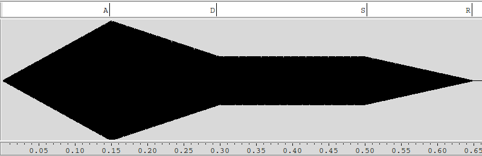
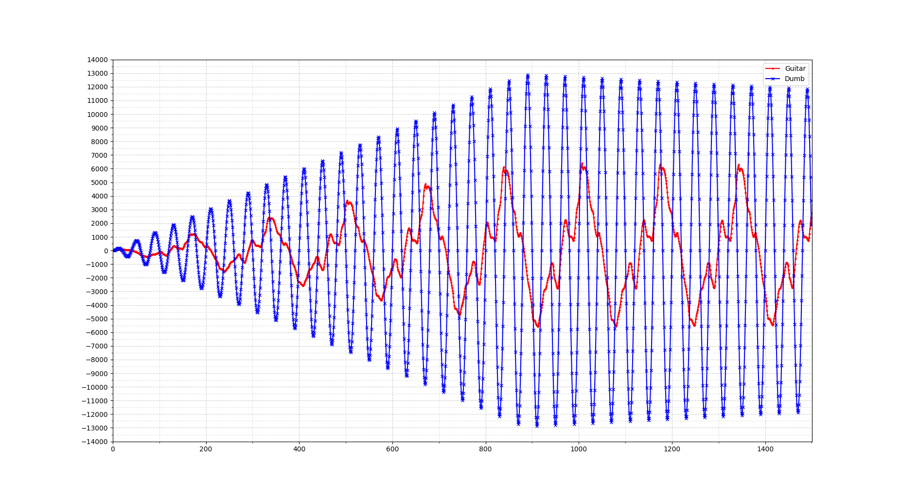

PAV - P5: síntesis musical polifónica
=====================================

## Andrea Iturralde - Albert Gassol


Obtenga su copia del repositorio de la práctica accediendo a [Práctica 5](https://github.com/albino-pav/P5) 
y pulsando sobre el botón `Fork` situado en la esquina superior derecha. A continuación, siga las
instrucciones de la [Práctica 2](https://github.com/albino-pav/P2) para crear una rama con el apellido de
los integrantes del grupo de prácticas, dar de alta al resto de integrantes como colaboradores del proyecto
y crear la copias locales del repositorio.

Como entrega deberá realizar un *pull request* con el contenido de su copia del repositorio. Recuerde que
los ficheros entregados deberán estar en condiciones de ser ejecutados con sólo ejecutar:

~~~~~~~~~~~~~~~~~~~~~~~~~~~~~~~~~~~~~~~~~~~~~~~~~~~~~.sh
  make release
~~~~~~~~~~~~~~~~~~~~~~~~~~~~~~~~~~~~~~~~~~~~~~~~~~~~~

A modo de memoria de la práctica, complete, en este mismo documento y usando el formato *markdown*, los
ejercicios indicados.

Ejercicios.
-----------

### Envolvente ADSR.

Tomando como modelo un instrumento sencillo (puede usar el InstrumentDumb), genere cuatro instrumentos que
permitan visualizar el funcionamiento de la curva ADSR.

* Un instrumento con una envolvente ADSR genérica, para el que se aprecie con claridad cada uno de sus
  parámetros: ataque (A), caída (D), mantenimiento (S) y liberación (R).
* Un instrumento *percusivo*, como una guitarra o un piano, en el que el sonido tenga un ataque rápido, no
  haya mantenimiemto y el sonido se apague lentamente.
  - Para un instrumento de este tipo, tenemos dos situaciones posibles:
    * El intérprete mantiene la nota *pulsada* hasta su completa extinción.
    * El intérprete da por finalizada la nota antes de su completa extinción, iniciándose una disminución
	  abrupta del sonido hasta su finalización.
  - Debera representar en esta memoria **ambos** posibles finales de la nota.
* Un instrumento *plano*, como los de cuerdas frotadas (violines y semejantes) o algunos de viento. En
  ellos, el ataque es relativamente rápido hasta alcanzar el nivel de mantenimiento (sin sobrecarga), y la
  liberación también es bastante rápida.

Para los cuatro casos, deberá incluir una gráfica en la que se visualice claramente la curva ADSR. Deberá
añadir la información necesaria para su correcta interpretación, aunque esa información puede reducirse a
colocar etiquetas y títulos adecuados en la propia gráfica (se valorará positivamente esta alternativa).

Hemos generado cuatro instrumentos: uno genérico, dos percusivos y uno plano. 

##### Genérico



##### Percusivo 1


##### Percusivo 2


##### Plano


### Instrumentos Dumb y Seno.

Implemente el instrumento `Seno` tomando como modelo el `InstrumentDumb`. La señal **deberá** formarse
mediante búsqueda de los valores en una tabla.

- Incluya, a continuación, el código del fichero `seno.cpp` con los métodos de la clase Seno.

`seno.h`
```cpp

#include "wavfile_mono.h"

namespace upc {
  class Seno: public upc::Instrument {
    EnvelopeADSR adsr;
    float phase;
    float step1, step2;
    float nota;
    int N;
    unsigned int index;
	float A;
    std::vector<float> tbl;
  public:
    Seno(const std::string &param = "");
    void command(long cmd, long note, long velocity=1); 
    const std::vector<float> & synthesize();
    bool is_active() const {return bActive;} 
  };
}

#endif
  ```
`seno.cpp`

  ```cpp
  Seno::Seno(const std::string &param) 
  : adsr(SamplingRate, param) {
  bActive = false;
  x.resize(BSIZE);

  /*
    You can use the class keyvalue to parse "param" and configure your instrument.
    Take a Look at keyvalue.h    
  */
  KeyValue kv(param);
  
  /*
  /////////////////////////
  //     TAULA NORMAL    //
  /////////////////////////

  if (!kv.to_int("N",N))
    N = 40; //default value
  
  //Create a tbl with one period of a sinusoidal wave
  tbl.resize(N);
  float fase = 0;
  phase = 0;
  index = 0;
  step1 = 2 * M_PI /(float) N;
  //index = 0;
  for (int i=0; i < N ; ++i) {
    tbl[i] = sin(fase);
    fase += step1;
  }
  */

  /////////////////////////
  //     TAULA FITXER    //
  /////////////////////////
  std::string file_name = "period2.wav";
  static string kv_null;
  /*
  if ((file_name = kv("guitar.wav")) == kv_null) {
    cerr << "Error: no se ha encontrado el campo con el fichero de la señal para un instrumento FicTabla" << endl;
    throw -1;
  }
  */
  unsigned int fm;

  if (readwav_mono(file_name, fm, tbl) < 0) {
    
    cerr << "Error: no se puede leer el fichero " << file_name << " para un instrumento FicTabla" << " (" << strerror(errno) << ")"<< endl;
    throw -1;
  }


  N = tbl.size();
  cout<<N<<endl;
  phase = 0;
  index = 0;
  step1 = 2 * M_PI /(float) N;

  
}


void Seno::command(long cmd, long note, long vel) {
  if (cmd == 9) {		//'Key' pressed: attack begins
    bActive = true;
    adsr.start();
    float f0 = 440.0 * pow(2 ,((float)note-69.0)/12.0);
    cout<<f0<<endl;
    nota = f0/SamplingRate;
	  A = vel / 127.;
    step2 = 2 * M_PI * nota;
    cout<<nota<<", "<<step2/step1<<endl;
    phase = 0;
    index = 0;
    resta = 0;
  }
  else if (cmd == 8) {	//'Key' released: sustain ends, release begins
    adsr.stop();
  }
  else if (cmd == 0) {	//Sound extinguished without waiting for release to end
    adsr.end();
  }
}


const vector<float> & Seno::synthesize() {
  if (not adsr.active()) {
    x.assign(x.size(), 0);
    bActive = false;
    return x;
  }
  else if (not bActive)
    return x;

  for (unsigned int i=0; i<x.size(); ++i) {
    
    if(phase == (int)phase){
      
      x[i] = A*tbl[index]; 
   
    }else{

      int index1 = (int)ceil(phase);
      int index2 = (int)floor(phase);
      float alpha1 = (float) index2 - phase;
      float alpha2 = (float) phase - index1;

      if(index2 == N){

        index2 = 0;
      }

      x[i] = 0.8*(tbl[index1]*(alpha1) + tbl[index2]*(alpha2));

    }

    resta++;
    phase += step2/step1;
    index = phase;
    cout<<x[i]<<","<<phase<<endl;

    if(index >= N){
      phase = step2/step1;
      index = 0;
      //phase -= resta*(step2/step1);
    }
    //while (phase > 2*M_PI) phase -= 2*M_PI; 
  } 
  adsr(x); //apply envelope to x and update internal status of ADSR

  return x;
}


  ```

- Explique qué método se ha seguido para asignar un valor a la señal a partir de los contenidos en la tabla,
  e incluya una gráfica en la que se vean claramente (use pelotitas en lugar de líneas) los valores de la
  tabla y los de la señal generada.

Hemos utilizado interpolación lineal para asignar un valor a la señal a partir de los contenidos de la tabla. El resultado es el siguiente:


- Si ha implementado la síntesis por tabla almacenada en fichero externo, incluya a continuación el código
  del método `command()`.

El metodo comand se puede ver en el código insertado anteriormente. No se ha modificado para implementar la síntesis por tabla, solo se ha modificado el constructor para que lea un fichero WAVE que contiene un período de una señal musical producida por una guitarra. El resultado, comparado con la señal generada por InstrumentDumb, es el siguiente:



### Efectos sonoros.

- Incluya dos gráficas en las que se vean, claramente, el efecto del trémolo y el vibrato sobre una señal
  sinusoidal. Deberá explicar detalladamente cómo se manifiestan los parámetros del efecto (frecuencia e
  índice de modulación) en la señal generada (se valorará que la explicación esté contenida en las propias
  gráficas, sin necesidad de *literatura*).
- Si ha generado algún efecto por su cuenta, explique en qué consiste, cómo lo ha implementado y qué
  resultado ha producido. Incluya, en el directorio `work/ejemplos`, los ficheros necesarios para apreciar
  el efecto, e indique, a continuación, la orden necesaria para generar los ficheros de audio usando el
  programa `synth`.

### Síntesis FM.

Construya un instrumento de síntesis FM, según las explicaciones contenidas en el enunciado y el artículo
de [John M. Chowning](https://ccrma.stanford.edu/sites/default/files/user/jc/fm_synthesispaper-2.pdf). El
instrumento usará como parámetros **básicos** los números `N1` y `N2`, y el índice de modulación `I`, que
deberá venir expresado en semitonos.

- Use el instrumento para generar un vibrato de *parámetros razonables* e incluya una gráfica en la que se
  vea, claramente, la correspondencia entre los valores `N1`, `N2` e `I` con la señal obtenida.
- Use el instrumento para generar un sonido tipo clarinete y otro tipo campana. Tome los parámetros del
  sonido (N1, N2 e I) y de la envolvente ADSR del citado artículo. Con estos sonidos, genere sendas escalas
  diatónicas (fichero `doremi.sco`) y ponga el resultado en los ficheros `work/doremi/clarinete.wav` y
  `work/doremi/campana.work`.
  * También puede colgar en el directorio work/doremi otras escalas usando sonidos *interesantes*. Por
    ejemplo, violines, pianos, percusiones, espadas láser de la
	[Guerra de las Galaxias](https://www.starwars.com/), etc.

### Orquestación usando el programa synth.

Use el programa `synth` para generar canciones a partir de su partitura MIDI. Como mínimo, deberá incluir la
*orquestación* de la canción *You've got a friend in me* (fichero `ToyStory_A_Friend_in_me.sco`) del genial
[Randy Newman](https://open.spotify.com/artist/3HQyFCFFfJO3KKBlUfZsyW/about).

- En este triste arreglo, la pista 1 corresponde al instrumento solista (puede ser un piano, flautas,
  violines, etc.), y la 2 al bajo (bajo eléctrico, contrabajo, tuba, etc.).
- Coloque el resultado, junto con los ficheros necesarios para generarlo, en el directorio `work/music`.
- Indique, a continuación, la orden necesaria para generar la señal (suponiendo que todos los archivos
  necesarios están en directorio indicado).

También puede orquestar otros temas más complejos, como la banda sonora de *Hawaii5-0* o el villacinco de
John Lennon *Happy Xmas (War Is Over)* (fichero `The_Christmas_Song_Lennon.sco`), o cualquier otra canción
de su agrado o composición. Se valorará la riqueza instrumental, su modelado y el resultado final.
- Coloque los ficheros generados, junto a sus ficheros `score`, `instruments` y `efffects`, en el directorio
  `work/music`.
- Indique, a continuación, la orden necesaria para generar cada una de las señales usando los distintos
  ficheros.
